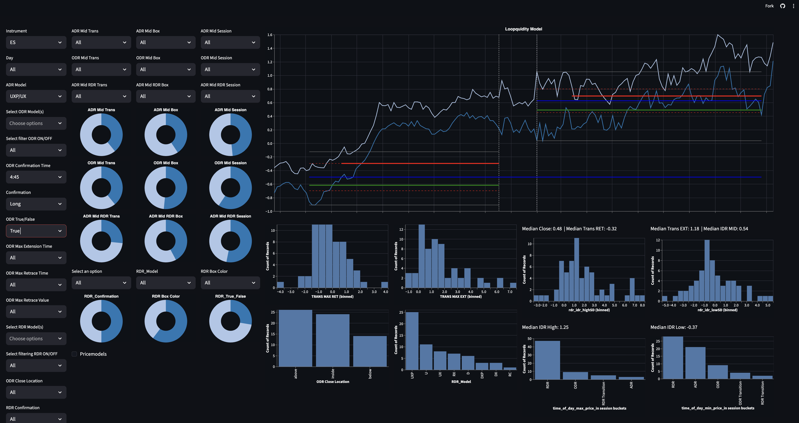
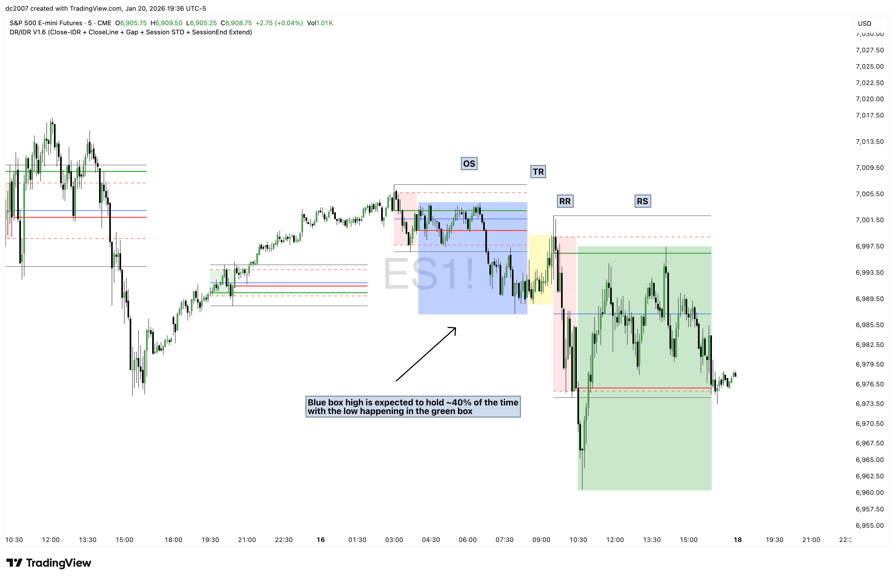
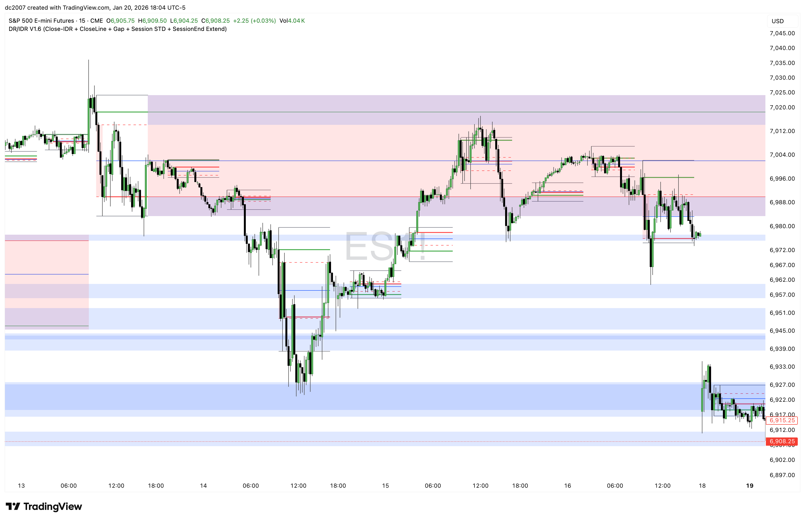
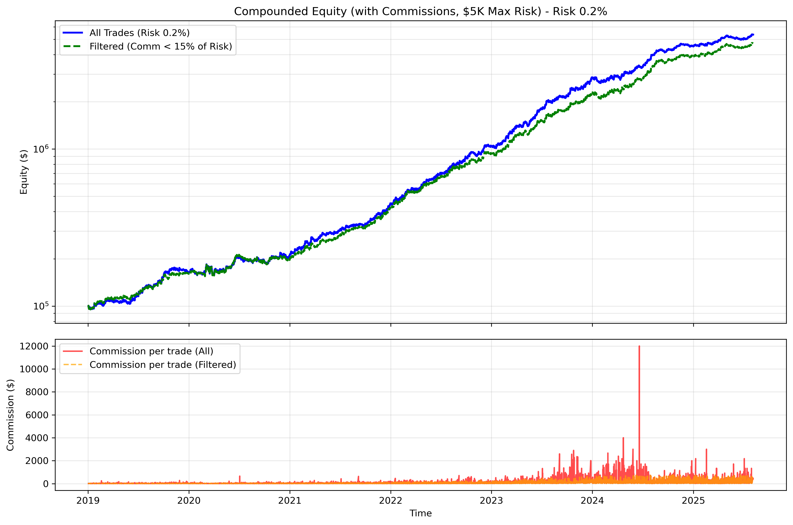
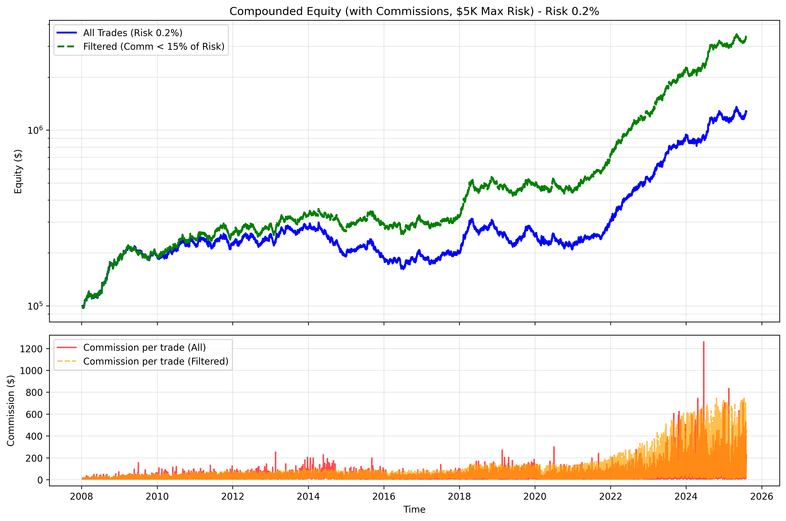

# Researched Ideas

A comprehensive research workspace exploring systematic trading strategies, market microstructure, and quantitative approaches to futures and equity trading.

## Table of Contents

- [Overview](#overview)
  - [Repository Structure](#repository-structure)
- [The Research Journey](#the-research-journey)
  - [Starting Point: Understanding the Market](#starting-point-understanding-the-market)
  - [Sequencing](#sequencing)
  - [Volume and Volume Imbalances](#volume-and-volume-imbalances)
  - [Cluster Levels and Support/Resistance](#cluster-levels-and-supportresistance)
  - [IMPORTANT: Best Rejections](#important)
- [Turning This Information Into Actual Trading Systems](#turning-this-information-into-actual-trading-systems)
  - [Simple Vs Complex Systems](#simple-vs-complex-systems)
  - [Two Trade RS Session Break Out](#two-trade-rs-session-break-out)
  - [RR + RS Range Break Out](#rr--rs-range-break-out)
  - [Quarterly Trading System](#quarterly-trading-system)
- [Complex Systems](#complex-systems)
  - [My First ML Based Trading System](#my-first-ml-based-trading-system)
  - [The AI Trading Agent](#the-ai-trading-agent)
    - [Core System: AI Trader Agent](#core-system-ai-trader-agent)
    - [Model Types in Consolidated Outputs](#model-types-in-consolidated-outputs)
- [Trading Using the Agent](#trading-using-the-agent)
- [Breakout Strategy Insights](#this-is-really-important-because-it-highlights-the-concept-of-letting-your-winners-run-alongside-the-emphasis-of-risk-management-its-possible-there-is-no-directional-edge-in-this-strategy-yet-it-has-a-solid-return-profile-especially-on-an-asset-that-is-arguably-range-bound-like-cl-this-also-is-very-simple-and-could-probably-be-mirrored-using-a-much-simpler-feature-set-or-raw-approach)
- [Transformer Test](#transformer-test)
- [Current Projects/Approaches Being Studied](#current-projectsapproaches-being-studied)
  - [TMPI: Temporal Market Program Induction](#tmpi-temporal-market-program-induction)
  - [MCP Servers and Narratives → LLM-Based Trade Signals](#mcp-servers-and-narratives--llm-based-trade-signals)
- [Contributing](#contributing)
- [License](#license)
- [Contact](#contact)

---

## Overview

This repository represents years of research into market patterns, session-based trading strategies, and data-driven decision making. The work spans multiple approaches—from intraday session analysis to quarterly range breakouts, from volume imbalances to machine learning-driven state builders.

### Repository Structure

This folder is a workspace for multiple trading/ML research threads. The primary repo is `ai-trader-agent/`.

**Top-level folders:**

- **`ai-trader-agent/`**: Live-world + adapters + consolidated outputs + TMPI + MCP assistant tooling.
  - Start here: `ai-trader-agent/README.md`
  
- **`backtest_results_rdr_box_breakout/`**, **`backtest_results_rdr_session/`**: Saved backtest outputs (figures/CSVs) for specific RDR-related experiments.

- **`quarterly_and_downloader_bundle/`**: Quarterly range breakout strategy backtests (direct trading and options variants) with equity curve generation and performance analysis.
  - See `quarterly_and_downloader_bundle/README.md` for strategy details.

- **`breakout_optimization/`**: Breakout strategy optimization with XGBoost classifiers, walk-forward validation, and 0.8% stop loss strategy (ES, CL, GC).
  - See `breakout_optimization/README.md` for optimization details.

- **`TransformerTest/`**: Scratch area for transformer/model experiments (not coupled to `ai-trader-agent/`).

- **`Example Data ES.csv`**: Small example dataset used by one-off scripts/notebooks.

For a complete directory tree, see [REPOSITORY_TREE.md](REPOSITORY_TREE.md).

---

## The Research Journey

### Starting Point: Understanding the Market

The foundation of this work began with understanding how markets behave. Firstly the one fundamental thing that is constant is time. There will always be a 9:30am, the same for having days of the week and so forth. (As 24 hour markets continue to develop, imporance of certain times may change). This understanding allows you to build time based ranges from which distributions of price and data can be calculated from. Furthermore, this concept is fractal and allows you to create ranges using any time frame and any range of time. The important part is that you have this initial or defining range and it gives you the basis to model the developing session. An important part of the range is the true rate. Once price breaks out of the range, what % of the time will it trade through the opposite side of the range.

#### Intraday Session Cycles


This is the intraday and overnight cycle with the Asia, London, and New York cycle. They each have the first hour of the session defining the range, and the rest of the session. 
NY 9:30-10:25 range, 10:30-15:55 session.
It is based of their timezones typical futures, equities, and currency markets opening.

These ranges can be from the 1 minute, to the 5 minute. ect.. some interesting and notable ranges:

First 5 minutes of every hour, rest of the hour as the session

First 9:30am Day n -> 9:25am Day n+1 of a week. The session is the following 4 days.

First friday and the day before it of every quarter. -> session holds to the next quarters first friday.

First Quarter of the year defining for the next 3 quarters of the year.

<table>
<tr>
<td width="33%">
<strong>1 Hour</strong><br/>

<p style="font-size: 0.9em;"></p>
</td>
<td width="33%">
<strong>Quarterly DR</strong><br/>

<p style="font-size: 0.9em;"></p>
</td>
<td width="33%">
<strong>Yearly</strong><br/>

<p style="font-size: 0.9em;"></p>
</td>
</tr>
</table>


Using a range allows you to develop features and distributions that can give linear and non linear relation ships. 
For instance after the break out of range you can calculate how deep it will pull back / retrace, and how far it will extend. this can be done in both % change and in standard deviations of the range. Ie what % of the time do we go below the ranges midpoint. 

The location of the open and close, in relation to the range can give a solid linear relation to which way price will break out of the range. For instance a green box, will lead to a break out long on the ES about 70% of the time. box std as its known in my feature set.

Another feature is the location of the ranges in relation to each other. For instance a long true london/OR range will 50% of the time result in an Upside box where price is above the london range. This is the Model Data Base

# The market can be looked at as 3 vectors, time, price, location
## 4 if you include good volume data


<table>
<tr>
<td width="33%">
<strong>Quarterly Data Analysis</strong><br/>

<p style="font-size: 0.9em;">Quarterly range breakout analysis showing how price behaves relative to quarterly ranges across multiple quarters. This data drives the quarterly trading strategies. Long break out shown</p>
</td>
<td width="33%">
<strong>Model Data & Predictions</strong><br/>

<p style="font-size: 0.9em;">Model database where probabilities to where the next session will be location wise and its potential outcomes can be developed</p>
</td>
<td width="33%">
<strong>RDR Breakout Data</strong><br/>

<p style="font-size: 0.9em;">Regular Range session breakout analysis showing the distribution of price for a long breakout in the first 15 minutes of the session</p>
</td>
</tr>
</table>

https://models-rda4qjmdgur4qh7rvpfeaq.streamlit.app/
link to the model database

### Sequencing

Data on how highs and lows form is also particularly interesting and in some cases useful. For instance in the 9:30am to 9:25am Day n+1 cycle, the normalized paring of the highs and lows and which time their formed into is the new york / RR+RS paired with the london out session and its transition into the ny / OS + TR. This pairing of the high is in New York and the low is in London / TR, or vice versa (low ny - high lon) is 60% of the data. 

A general rule is that which ever high or low came first is the one expected to hold. This tends to be clear in the data, but also makes sense from a logic stand point where markets are either trending or ranging. If your a trending trader the expecting the first extreme to hold is very useful.

In the 04:00 to 15:55 cycle, the high or low of the 4am to 8:25am is expected to hold roughly 40% of the time on the Equities markets. with the 9:30-10:25 extreme paired with the 10:30-15:55 extreme being roughly 30% of the data.

In short this is a way of determing which highs and lows of the day are important to hold/trade from. It is another data based model.




## Data is a very big part of trading and it should a central focus point, but at this depth it it does not show and highlight important / real time occurences in the market.

### Volume and Volume Imbalances

Volume is something that was generally avoided as any accessible volume data was not particularly great. 

When a candle had a difference in open and close prices it was a clear sign of the market having a strong direction. Take for instance a gap up or a gap down on a daily stock chart. These are considered to have strong momentum depending on the size of the gap. 

gapUp =  close[1] >= open[1] and open > close[1] and close > open

gapDown = close[1] <= open[1] and open < close[1] and close < open

The same logic can be applied to the volume imbalance / open close imbalance that occurs on lower time frames. Logically it is the algorithms strugling to fill orders as fast as possible in that direction. These are present on tick charts aswell and are truly the market struggling to fill orders. 

99.7% of all 5m imbalances from 2016 onwards have been filled on NQ futures and on any given day, its 94%. 

Volume imbalances are very very interesting. The 1 minute imbalances when formed and filled (price returns to the gap) often have a nice directionality to them. They add very interesting areas for market participants to interact at. 


### Cluster Levels and Support/Resistance

Support and Resistance has for a long time been a topic of traders and investors. There probably is some truth in it. 

The Commitment of Traders for Futures Markets is released every Friday using the tuesday trading sessions data. A lot of people find the COT data useful to trade off of as it shows how people are positioned. If we take the New York First hour and take the high, high close, low, and low close, we can draw out consistent weekly levels that we can observe price to react to.

Dark pool levels are the orders that are filled comming in over the weekend. 
With monthly levels being the first thursday of the month, typically before the nonfarm payrolls release.
 
 ES rejection data from 2008-2025

| Metric            | Count (n) | Any    | Weekly | Monthly | Darkpool |
|-------------------|:---------:|:------:|:------:|:-------:|:--------:|
| Day High          | 4,589     | 48.8%  | 30.9%  | 16.5%   | 22.9%    |
| Day Low           | 4,589     | 59.3%  | 38.4%  | 18.9%   | 28.2%    |
| RR box_high       | 4,534     | 55.2%  | 34.6%  | 17.8%   | 27.3%    |
| RR box_low        | 4,534     | 60.1%  | 38.6%  | 19.4%   | 28.8%    |
| RR session_high   | 4,589     | 54.6%  | 34.2%  | 17.6%   | 27.0%    |
| RR session_low    | 4,589     | 59.4%  | 38.1%  | 19.1%   | 28.5%    |

Importantly the weekly levels are the most consistent in developing the box highs and lows, with 1/3 of the highs or lows containing a weekly level. 

- Act as natural support/resistance
- Attract price on retests
- Often trigger reversals or accelerations

## IMPORTANT
### The best rejections will have a perfect close price aligned with the levels, or a perfect wick to the level




# Turning this information into actual trading systems

## Simple Vs Complex Systems

### In my experience I have found simple systematic trading approaches to be superior to complex machine learning aided solutions

## Two Trade RS session break out


The rules for this strategy were pretty simple. a copy can be found in the rdr_session backtest folder.

[backtest_results_rdr_session/](backtest_results_rdr_session/)

9:30-10:25 range, breakouts from 10:30-15:55

It trades a break out and takes two trades. One expecting a smaller retracement / nice trendy day. The second being a deeper retracement. 

On paper with no slippage its quite a strong performing strategy giving 4.2 sharpe ratio. 
Adding commissions drops it to about 2.5 Sharpe

Once you add slippage (a very common occurence) the results drop dramatically.
The strategy drops to a 1.9 Sharpe pre-commissions and once you include commissions it becomes a sub 1 Sharpe.

This is without mentioning the liquidity issues that your going to run into as some instruments wont be able to accomodate the needed size.

<table>
<tr>
<td width="33%">
<strong>Commissions</strong><br/>

<p style="font-size: 0.9em;"></p>
</td>
<td width="33%">
<strong>Slippage</strong><br/>

<p style="font-size: 0.9em;"></p>
</td>
<td width="33%">
<strong>Commissions + Slippage</strong><br/>

<p style="font-size: 0.9em;"></p>
</td>
</tr>
</table>

I used this system as a systematic base for a discretionary trading system. The confluences and volume imbalances alongwith unique daily data were used to reason and develop trade ideas which were then executed into the market. It allowed me to generate about 80k in profit from online bucket/prop shops.


## RR + RS range break out 

This was another simple strategy that on paper worked nicely, but has a strong liquidity cap and also suffers alot from slippage. It realistically cannot have larger size added in as its trading during the overnight session and for the portfolio to stay balanced it would be difficult to risk more than $500 dollars per trade. This is doable in the NQ, ES, and CL, but becomes particularly difficult in 6J. Especially as overnight slippage would very much reduce the results of this system.

[backtest_results_rdr_box_breakout/](backtest_results_rdr_box_breakout/)

## Quarterly Trading System

This was a system with using some simple logic about the quarterly ranges as a swing trading/position trading system. It works nicely on the SPX stock index, but it failes to hold up well across individual stocks, futures, forex and other markets. In crypto it works really well. 

 Trading options was not quite a feasible activity using a simplified black sholes calculation but without the proper data this backtest is unreliable.

[quarterly_and_downloader_bundle/](quarterly_and_downloader_bundle/)


<table>
<tr>
<td width="50%">
<strong>Quarterly SPX Range Breakout Performance</strong><br/>

</td>
<td width="50%">
<strong>Options Strategy Performance</strong><br/>

</td>
</tr>
</table>


# Complex Systems

### My First ML based trading system
This was based on using the box color and box size(STD) to predict trading direction across the ES, YM, and NQ. When 2/3 aligned with enough strengh this gave an appropriate signal to take a trade in the proper direction. Then it would use the distribution data from the start cut of date only and trade forward from it. It would take the strongest opening range of the three and bet on the break out happening.

It used far to many features and most likely could have been done with 1-2 features tops and had a simple eslastic net do the prediction part for it. 

The more important thing, is that it was likely very much overfitted and would not have held up in real world conditions. I actually even set up a pipeline to run it live via FTMO as an algo on MT5, but I convinced myself while having a decent sharpe the consistency and trade frequency was not nearly high enough to justify running. 


## The AI Trading Agent

This project started roughly in the end of august where I started building a data pipeline of all the modeling processes that I could think of that would be useful and that I thought about or looked at while trading. This was done with the intention of developing an Agent that would trade on my behalf using logic and reasoning. 

It sequentially generates 4 outputs files that have data and rejection information that could be fed into machine learning as a time series.

- Features  
- Probabilities  
- Individual Rejections  
- Combined Rejections


- [consolidated_live_features_ES_2025-08-24_to_2025-12-05.parquet](consolidated_live_features_ES_2025-08-24_to_2025-12-05.parquet)
- [consolidated_probabilities_ES_2025-08-22_2025-12-05.parquet](consolidated_probabilities_ES_2025-08-22_2025-12-06.parquet)
- [rejection_events_combined_ES_2025-08-24_to_2025-12-05.parquet](rejection_events_combined_ES_2025-08-24_to_2025-12-05.parquet)
- [rejection_events_ES_2025-08-24_to_2025-12-05.parquet](rejection_events_ES_2025-08-24_to_2025-12-05.parquet)

### Core System: AI Trader Agent

The `ai-trader-agent/` repository is a complete live trading system organized into four main layers:

#### 1. Data Ingestion / Raw Market Data
- **Input Location**: `ai-trader-agent/data/raw/` (plus `data/csv/` and `data/news/` for specific workflows)
- **Bar Cadence**: System assumes 5-minute bar cadence for "live" style processing
- **Data Format**: Processed from raw market feeds into standardized 5-minute OHLCV bars

#### 2. World-State Building (Feature/State Layer)
- **Core Logic**: `ai-trader-agent/src/world/` contains session management, ranges, sequencing, WDDRB, and modeldb concepts
- **Live World Builder**: `ai-trader-agent/src/world/fusion/live_world.py` (and related fusion code)
  - Incrementally updates session/range state as each bar arrives
  - Maintains state across all sessions (AR, OR, RR, AS, OS, RS)
  - Emits immutable snapshots for downstream readers
  - Tracks features needed for predictions:
    - Range geometry (IDR, DR, box_std)
    - Sequencing data (intraday highs/lows)
    - Mid breaks (ADR/ODR)
    - Rejection events

#### 3. Adapters / Probability Generation
- **Reader Adapters**: `ai-trader-agent/src/world/fusion/model_adapters_*.py`
  - Compute context + probabilities from snapshots and/or historical tables
  - Query historical databases for similar patterns
  - Return probabilities for various outcomes (confirmations, extensions, retracements)
- **Probability Utilities**: `ai-trader-agent/src/world/fusion/probability.py`
  - LikelihoodStacker for stacking probabilities across multiple models
  - Weight by model confidence
  - Handle correlated predictions

#### 4. Consolidation (Main Shared Output)
- **Export Pipeline**: `ai-trader-agent/src/world/fusion/consolidated_live_engine.py`
  - Exports "single-row" consolidated tables
  - Features and probabilities aligned per timestamp/session
- **Output Location**: `ai-trader-agent/consolidated_live_outputs/`
  - Time-windowed parquet/CSV files
  - Includes: features, probabilities, levels, rejection events

#### Model Types in Consolidated Outputs

The system produces two kinds of models in the consolidated outputs:

**A. Regime/Classification Models** (discrete codes with `p_model_*` probabilities)
- **ModelDB Range-Relationship Model** → `modeldb_live_v3_*.csv`
  - Columns: `p_model_rc`, `p_model_rx`, `p_model_ux`, `p_model_dx`, `p_model_uxp`, `p_model_dxp`, `p_model_u`, `p_model_d`
  - Code definitions based on how current session's IDR close-band sits vs prior session's band:
    - **RC**: Current inside prior (contained)
    - **RX**: Current engulfs prior (expansion)
    - **UX/DX**: Shifted up/down into prior's upper/lower half
    - **UXP/DXP**: Fully above/below prior range
    - **U/D**: Partial up/down cases

- **WDDRB Model-Code Regime Classifier** → `wddrb_model_adapter_*.csv`
  - Columns: `p_model_ug`, `p_model_u`, `p_model_ux`, `p_model_o`, `p_model_i`, `p_model_dx`, `p_model_d`, `p_model_dg`
  - Code meanings: I (inside), O (engulf), U/D (clean above/below), UX/DX (straddle-up/down), plus gap codes UG/DG

**B. Event-Probability Models** (direct probabilities of specific trade-relevant events)

- **Range-Session Metrics Model** → `range_session_metrics_v3_*.csv`
  - Provides "will it confirm / how will it behave after confirm" probabilities:
  - Columns: `p_confirm_long`, `p_confirm_short`, `p_false_session`, `p_m7_ret_sd`, `p_m7_time`, `p_max_ext_sd`, `p_max_ext_time`, `p_max_ret_sd`, `p_max_ret_time`

- **First-Range / First-Candle Model** → `first_range_candle_context_*.csv`
  - Early-session structure probabilities:
  - Columns: `p_first_break_true_*`, `p_touched_rbc`, `p_touched_m7`, `p_session_box_dir_up/down`

- **Sequencing Models**:
  - **Intraday** → `seq_intraday_v3_*.csv`: Probabilities of where day's high/low forms by session + hold probabilities
  - **Asia** → `seq_asia_v3_*.csv`: Similar, but specifically for Asia-window highs/lows
  - **Day Cycle** → `seq_daycycle_v3_*.csv`: 24h "cycle pair" + hold probabilities

- **WDDRB Adapter Event Model** → `wddrb_adapter_v3_*.csv`
  - Hold/break probabilities: `p_full_*_holds`, `p_post_*_holds`, `p_break_long/short`

- **Weekly / BoxDaily Context**:
  - **Weekly** → `weekly_adapter_v3_*.csv`: `p_week_high_holds`, `p_week_low_holds`
  - **Box Daily** → `box_daily_v3_*.csv`: Context features (volatility buckets, mid/levels, etc.) more than probabilities

## Trading Using the Agent

The only successful but also very informative trading system developed so far from this large database is using ML to determine if we should buy or sell the range break out and hold into the next session. It uses XGboost to analyze the candle row that occurs in the break out and holds it either to the end of the session or the end of the trading day. 

A lot of models were tested across, TABpfn, GRU, LSTM, Neural Networks, ect.

[breakout_optimization/](breakout_optimization/)


# This is really important because it highlights the concept of letting your winners run alongside the emphasis of risk management. Its possible there is no directional edge in this strategy yet it has a solid return profile especially on an asset that is arguably range bound like CL. This also is very simple and could probably be mirrored using a much simpler feature set or raw approach.


## Transformer Test

### Test on using a transformer with self attention to predict price from 10:30-15:55 RS

This test to build out a time series transformed with a few attetion heads and reinforcement learning did not strongly get anywhere unfortunately. It gave no direction edge above basic features or even probability for the ES. 
ES has a ~53% to close above or the 10:30 open price by 15:55, and this modeling architecture did not reach above the 53%.

[TransformerTest/](TransformerTest/)

# Current Projects/Approaches Being Studied.

**TMPI = Temporal Market Probability Inference**

Instead of just predicting "what will happen," TMPI is a decision framework that answers: **"Given where we are in time, what market state are we in, what transitions are likely next, and what is the highest expected-value action right now?"**

TMPI treats the market as a **time-structured probabilistic state machine**, not a continuous price series.

#### Core Philosophy

**Traditional ML:**
- Tries to predict price directly
- Ignores when decisions are made
- Treats all timestamps equally

**TMPI flips this:**
- **Time → decision checkpoints**
- **Price → context**
- **Signals → state transitions**
- **Trades → actions with expected value**

This matches how human session traders and top prop desks think: trading at specific decision points, not continuously.

#### Key Concepts

**1. Time Is the Primary Axis (Not Price)**

In TMPI, time segments the market into regimes. For ES, decision nodes occur at:

| Time | Meaning | Decision Type |
|------|---------|---------------|
| 19:30 | Asia range starts | Range entry |
| 20:30 | Asia range completes | Breakout evaluation |
| 02:00 | Asia session ends | Session transition |
| 03:00 | London range starts | Range entry |
| 04:00 | London range completes | Breakout evaluation |
| 08:30 | London session ends | Session transition |
| 09:30 | RTH open | Range entry |
| 10:30 | RTH range completes | Breakout evaluation |
| 15:55 | Day closes | Session exit |

TMPI does not predict continuously — it predicts **only at these decision nodes**.

**2. Market State = Structured Context Vector**

At each decision node, TMPI builds a state vector with three components:

**A. Structural Context** (slow, stable)
- Asia/London/RTH range high, low, mid
- Weekly/daily/session anchors
- Distance from key levels
- Percentile of range expansion

**B. Probabilistic Beliefs** (from your adapters)
- P(range breakout)
- P(mid hold)
- P(session continuation)
- P(mean reversion)
- P(next session bias up/down/flat)

These are **beliefs, not signals**.

**C. Event Triggers** (fast, reactive - from Rejection Engine)
- Wick rejection
- Failed acceptance
- Impulse failure
- Volume divergence
- False breakout

Raw levels ≠ signals. **Events convert belief into action**.

**3. TMPI Is a Probabilistic State Transition Model**

Think Markov-like, but structured by time and events.

**Example Transition:**
```
State S0: Asia range complete, bias = up (0.62), price above Asia mid, no rejection yet

→ Transition Trigger: Wick rejection at Asia high

→ State S1: Failed upside acceptance, P(mean reversion) ↑, P(London down open) ↑
```

TMPI learns:
- Which transitions matter
- Which events override priors
- Which states produce positive expected-value trades

**4. Targets Are Not "Price Direction" — They're Outcomes**

**TMPI does not label:**
- "Price up or down"

**It labels:**
- Did this action at this time produce positive expected value?

**Targets look like:**
- Long / Short / No-Trade
- With fixed horizon (e.g., 24 bars, session end, next range)
- With TP/SL constraints (your rejection dataset setup)

This is why the rejection dataset matters so much — it provides labeled action outcomes, not price predictions.

**5. Why TMPI Needs the Rejection Engine**

**Without the rejection engine:**
- The model only sees static probabilities
- It can't tell when to act

**With it:**
- Static context → dynamic signal
- "We are near resistance" → useless
- "We were rejected at resistance" → actionable

**Rejections are state transition confirmations.** This is what turns your system into an agent, not a dashboard.

**6. How TMPI Becomes an Agent (Not Just ML)**

TMPI naturally maps to an agent loop:

```
FOR each decision time t:
    Observe state S_t
    Observe events E_t
    Compute belief update
    Choose action A_t ∈ {Long, Short, Flat}
    Execute with defined risk
    Observe outcome
    Update transition confidence
```

This is why:
- Supervised learning works first (label actions)
- RL later optimizes action selection, not prediction

**7. How This Maps to Your Codebase**

You already have the building blocks:

✅ **Time segmentation** - Sessions (AR, OR, RR, AS, OS, RS)  
✅ **Probability adapters** - ModelDB, Range-Session Metrics, Sequencing models  
✅ **Rejection logic** - Interaction engine, level store  
✅ **EV-based backtests** - Strategy performance evaluation  
✅ **Action menus** - Decision point logic  

**TMPI is simply the unifying abstraction** that connects these components into a coherent decision-making agent.

**Next Steps (When Ready):**
- Formalize a MarketState object
- Encode rejection events as transitions
- Train a policy model only at decision times
- Add RL to optimize when to act, not what price will do


### MCP Servers and Narratives → LLM-Based Trade Signals

This approach combines **Model Context Protocol (MCP) servers** with **narrative generation** to create LLM-based trade signals. The system exposes market state to language models and generates human-readable explanations that can be used for decision-making and learning.

#### MCP Server: Exposing Market State

**Purpose**: Expose consolidated market state (features + probabilities) to an MCP client so you can inspect/ask questions without importing the whole codebase, plus run a small amount of "reasoning" on top (stacking + trade-idea scaffolding).

**Implementation**: See `MCP_SERVER_PLAN.md` and implementation in `mcp_server.py`.

**Data Sources** (at runtime):
- **Primary**: Newest per-symbol parquet exports under `consolidated_live_outputs/` (features + probabilities)
  - Selected by timestamp/window logic in `mcp_server.py` (helpers like `_find_latest_file`, `_find_file_for_ts`, `_load_parquet_slice`)
- **Supporting Tables**: For idea generation
  - First-range DBs under `data/processed/<SYMBOL>/...`
  - Cluster tables under `data/processed/ES/ES_clusters_*.parquet`
  - Calibration data under `reports/archetype_calibration.json`

**Tools Exposed**:

1. **`list_symbols`**, **`list_data_sources`**: Discovery of what's available
2. **`get_feature_rows`**, **`get_probability_rows`**: Fetch recent rows (bounded by limit) for inspection
3. **`stack_probability`**: Maps a probability row into `LikelihoodStacker` inputs and produces a single blended probability for target events
   - Target events: confirm/holds/max-ext/etc.
   - Mirrors the stacker logic in `src/world/fusion/probability.py`
4. **`generate_trade_ideas`**: Turns "current state" into candidate trade ideas using:
   - First-range context
   - WDDRB levels
   - Cluster proximity
   - Rejection bias
   - Tags ideas with archetypes
   - Optionally uses calibrated stop/target heuristics (`reports/archetype_calibration.json`)
5. **`get_pretraining_trade_explanations`**: Returns rows from a prebuilt report CSV (`reports/pretraining_trade_explanations_with_future.csv`)
   - Allows MCP client to browse labeled examples and their context

#### Narrative Approach: Human-Readable Trade Explanations

**Goal**: Produce structured, human-readable "trade explanations" that are grounded in the same artifacts your system uses (range state, WDDRB, sequencing probabilities, clusters, rejection events).

This becomes:
- **Pretraining dataset**: Text explanations paired with outcomes/metadata
- **Debugging/inspection surface**: You can read why a trade idea was suggested
- **Features for lightweight policy learning**: Used by narrative RL bandit

**Core Builder**: `scripts/generate_narratives.py`

Defines a `NarrativeContext` and helper logic to assemble context "as-of" a timestamp:

**Context Assembly**:
- Pulls nearest feature/probability rows
- Collects range levels (AR/OR/RR), session status (true/false, break direction)
- Aggregates rejection stats near price and at key levels
- Checks cluster confluence
- Chooses dominant WDDRB model code + probability (from `wddrb_model_p_model_*` columns) and derives target levels

**Dataset Generation**:

1. **`scripts/generate_pretraining_narratives.py`**:
   - Takes a CSV of historical "pretraining trades"
   - Builds a `NarrativeContext` per trade timestamp
   - Writes narrative text + structured fields to a report CSV

2. **`scripts/build_pretraining_trade_explanations.py`**:
   - Creates richer per-trade rows:
     - Aligns trades to consolidated probabilities
     - Computes stacked probabilities (via `LikelihoodStacker`)
     - Summarizes rejection/cluster proximity
     - Classifies archetypes (via `trading.archetype_logic.classify_archetype`)
   - This is the kind of data `mcp_server.py` serves back through `get_pretraining_trade_explanations`

**Policy Learning Hook**:

**`scripts/train_narrative_rl_bandit.py`**:
- Uses narrative context + simple feature vector:
  - Probabilities
  - Rejection bias
  - Cluster confluence
  - Archetype flags
  - etc.
- Trains/updates a lightweight bandit-style policy over candidate timestamps/archetypes

#### How It All Fits Together

```
Market State (consolidated outputs)
    ↓
MCP Server (exposes via tools)
    ↓
LLM Client (queries state, asks questions)
    ↓
Narrative Generation (explains reasoning)
    ↓
Trade Ideas (archetype-tagged, calibrated)
    ↓
Policy Learning (bandit optimization)
```

This approach enables:
- **Interactive exploration** of market state via natural language
- **Explainable AI** - understanding why trades are suggested
- **Learning from narratives** - training policies on human-readable explanations
- **Modular reasoning** - separate state building from decision-making

The narrative approach bridges the gap between raw market data and human understanding, making the system both more interpretable and more trainable.


---

## Contributing

This is a personal research repository, but feedback and discussions are welcome. If you find interesting patterns or have suggestions for improvements, feel free to open an issue.

---

## License

This work represents years of research and development. Please respect the intellectual property and cite appropriately if using ideas or code from this repository.

---

## Contact

orlandocantoni@outlook.com
347-986-8324

For questions or discussions about the research approaches, please open an issue or discussion in the repository.

---

*"The market has structure. Our job is to find it, quantify it, and trade it systematically."*
